# SortAlgorithm

This repository shows implementation for the Major Sort Algorithm.
Aim not to use LINQ or similar ease to use, but memory unefficient technique.

Suppose to work on following platform.

| Language | Platform | Remarks |
| ---- | ---- | ---- |
| C# | .NET 9.0 |
| Go | ?? | not yet.|
| PowerShell | PowerShell Core | not yet.|
| Pythom | 3.x | not yet.|
| Swift | 4.x | not yet.|

## TODO

CSharp Status

### Implementation

#### Exchange Sort

* [x] BubbleSort
* [x] OddEvenSort
* [x] CocktailShakerSort
  * [x] Optimized
  * [x] Normal
* [x] CombSort
* [x] StoogeSort
* [x] SlowSort
* [x] GnomeSort
  * [x] Optimized
  * [x] Normal
  * [x] Nearly Optimized
  * [x] Unefficient
* [x] StoogeSort
* [x] SlowSort

#### Selection Sort

* [x] SelectionSort
* [x] HeapSort
* [x] CycleSort

#### Insertion Sort

* [x] InsertSort
* [x] BinaryInsertSort
* [x] ShellSort
* [x] BinaryTreeSort

#### Partition Sort (+Exchange Sort)

* [x] QuickSort Median3
* [x] QuickSort Median9
* [x] QuickSort DualPivot
* [x] QuickSort Median3 + Insert
* [x] QuickSort Median9 + Insert
* [x] QuickSort DualPivot + Insert
* [x] QuickSort Median3 + BinaryInsert
* [x] QuickSort Median9 + BinaryInsert
* [x] QuickSort DualPivot + BinaryInsert

#### Merge Sort

* [x] MergeSort
  * [x] Optimized
  * [x] Normal
* [x] ShiftSort
* [x] DropMergeSort

#### Distributed Sort

* [x] BucketSort
  * [x] Int only
  * [x] T
* [x] RadixLSD10Sort
* [x] RadixLSD4Sort
* [x] CountingSort

#### Hybrid Sort

* [x] IntroSortMedian9 (Quick + Heap + Insert)
* [ ] TimSort (Merge + Insert) : WIP

#### Other Sort

* [x] PancakeSort

### Benchmark

* [ ] Benchmark : WIP

### Tests

* [x] UnitTest

### Data

* [x] CSV
* [x] Chart

## Result

### Better algorithm for Numerics

Algorithm | Stable | Space | Order | Remarks
---- | ---- | ---- | ---- | ----
Counting Sort | O | n + r | n + r | Need numeric key for T use.
Radix4 Sort (LSD) | O | n + 2^d | n*k/d | Need numeric key for T use. (Radix10 use mod.)

### Better always nice performance for general purpose

Algorithm | Stable | Space | Order | Remarks
---- | ---- | ---- | ---- | ----
QuickSort Median9(with BinaryInsertSort) | X | log n | n log n | May better on "Reversed, Mountain and NearlySorted" cases. But InsertSort shows a bit better performance on random.
QuickSort Median9(with InsertSort) | X | log n | n log n | Better than pure QuickSort Median 3 version and DualPivot QuickSort.
QuickSort DualPivot(InsertSort) | X | log 2n | n log n | Better than Median 3. Slightly unefficient on "Reversed, Mountain and NearlySorted" cases.
IntroSort | X | log n | n log n | MergeSort has some bug on this implementation. Need fix.
ShiftSort | O | n | n log n | Better than MergeSort and is Stable.
TimSort | O | n | n logg n | Not implemented yet.

Description Chart

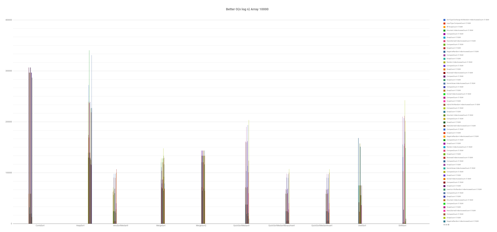

## Data

## Random

ShowData

#### Size : 100

InputType | ArraySize | IsSorted | SortType | Algorithm | IndexAccessCount | CompareCount | SwapCount
---- | ---- | ---- | ---- | ---- | ---- | ---- | ----
Random | 100 | True | Exchange | BubbleSort | 4950 | 4950 | 2061
Random | 100 | True | Exchange | OddEvenSort | 4752 | 4752 | 2061
Random | 100 | True | Exchange | CocktailShakerSort | 2968 | 2968 | 2061
Random | 100 | True | Exchange | CocktailShakerSort2 | 3519 | 3519 | 2061
Random | 100 | True | Exchange | CombSort | 1294 | 1294 | 230
Random | 100 | True | Exchange | CycleSort | 14321 | 14377 | 99
Random | 100 | True | Exchange | StoogeSort | 4950 | 4950 | 2061
Random | 100 | True | Exchange | SlowSort | 1795978 | 1795978 | 1931
Random | 100 | True | Exchange | GnomeSort | 2161 | 2061 | 2061
Random | 100 | True | Exchange | GnomeSort1 | 4213 | 4213 | 2061
Random | 100 | True | Exchange | GnomeSort2 | 2059 | 2152 | 2061
Random | 100 | True | Exchange | GnomeSort3 | 4222 | 4222 | 2061
Random | 100 | True | Selection | SelectionSort | 4950 | 4950 | 100
Random | 100 | True | Selection | HeapSort | 733 | 1081 | 639
Random | 100 | True | Insertion | InsertSort | 2061 | 2061 | 2061
Random | 100 | True | Insertion | BinaryInsertSort | 2790 | 531 | 2160
Random | 100 | True | Insertion | ShellSort | 432 | 282 | 432
Random | 100 | True | Insertion | BinaryTreeSort | 100 | 662 | 0
Random | 100 | True | Partition | QuickSortMedian3 | 415 | 709 | 211
Random | 100 | True | Partition | QuickSortMedian9 | 301 | 1182 | 225
Random | 100 | True | Partition | QuickDualPivotSort | 380 | 472 | 322
Random | 100 | True | Partition | QuickSortMedian3Insert | 341 | 351 | 105
Random | 100 | True | Partition | QuickSortMedian9Insert | 212 | 286 | 109
Random | 100 | True | Partition | QuickDualPivotSortInsert | 252 | 284 | 187
Random | 100 | True | Partition | QuickSortMedian3BinaryInsert | 410 | 396 | 113
Random | 100 | True | Partition | QuickSortMedian9BinaryInsert | 288 | 335 | 118
Random | 100 | True | Partition | QuickDualPivotSortBinaryInsert | 252 | 284 | 187
Random | 100 | True | Merge | MergeSort | 528 | 538 | 611
Random | 100 | True | Merge | MergeSort2 | 771 | 529 | 672
Random | 100 | True | Merge | ShiftSort | 887 | 663 | 13
Random | 100 | True | Distributed | BucketSort | 200 | 100 | 0
Random | 100 | True | Distributed | RadixLSD10Sort | 420 | 200 | 0
Random | 100 | True | Distributed | RadixLSD4Sort | 2787 | 0 | 0
Random | 100 | True | Distributed | CountingSort | 399 | 0 | 0
Random | 100 | True | Hybrid | IntroSortMedian9 | 275 | 333 | 122

#### Size : 1000

InputType | ArraySize | IsSorted | SortType | Algorithm | IndexAccessCount | CompareCount | SwapCount
---- | ---- | ---- | ---- | ---- | ---- | ---- | ----
Random | 1000 | True | Exchange | BubbleSort | 499500 | 499500 | 253232
Random | 1000 | True | Exchange | OddEvenSort | 480519 | 480519 | 253232
Random | 1000 | True | Exchange | CocktailShakerSort | 337069 | 337069 | 253232
Random | 1000 | True | Exchange | CocktailShakerSort2 | 384540 | 384540 | 253232
Random | 1000 | True | Exchange | CombSort | 22703 | 22703 | 4118
Random | 1000 | True | Exchange | CycleSort | 1486526 | 1486985 | 999
Random | 1000 | True | Exchange | StoogeSort | 499500 | 499500 | 253232
Random | 1000 | True | Exchange | GnomeSort | 254232 | 253232 | 253232
Random | 1000 | True | Exchange | GnomeSort1 | 507450 | 507450 | 253232
Random | 1000 | True | Exchange | GnomeSort2 | 253226 | 254218 | 253232
Random | 1000 | True | Exchange | GnomeSort3 | 507464 | 507464 | 253232
Random | 1000 | True | Selection | SelectionSort | 499500 | 499500 | 1000
Random | 1000 | True | Selection | HeapSort | 10570 | 17212 | 9578
Random | 1000 | True | Insertion | InsertSort | 253232 | 253232 | 253232
Random | 1000 | True | Insertion | BinaryInsertSort | 263812 | 8582 | 254231
Random | 1000 | True | Insertion | ShellSort | 9657 | 4821 | 9657
Random | 1000 | True | Insertion | BinaryTreeSort | 1000 | 10825 | 0
Random | 1000 | True | Partition | QuickSortMedian3 | 7054 | 10046 | 2820
Random | 1000 | True | Partition | QuickSortMedian9 | 4892 | 13902 | 2995
Random | 1000 | True | Partition | QuickDualPivotSort | 6352 | 8336 | 4816
Random | 1000 | True | Partition | QuickSortMedian3Insert | 5621 | 5843 | 1655
Random | 1000 | True | Partition | QuickSortMedian9Insert | 3673 | 4541 | 1647
Random | 1000 | True | Partition | QuickDualPivotSortInsert | 5326 | 6702 | 3454
Random | 1000 | True | Partition | QuickSortMedian3BinaryInsert | 5752 | 5941 | 1666
Random | 1000 | True | Partition | QuickSortMedian9BinaryInsert | 3731 | 4584 | 1652
Random | 1000 | True | Partition | QuickDualPivotSortBinaryInsert | 5326 | 6702 | 3454
Random | 1000 | True | Merge | MergeSort | 6703 | 8715 | 9375
Random | 1000 | True | Merge | MergeSort2 | 10975 | 8722 | 9976
Random | 1000 | True | Merge | ShiftSort | 15037 | 11050 | 195
Random | 1000 | True | Distributed | BucketSort | 2000 | 1000 | 0
Random | 1000 | True | Distributed | RadixLSD10Sort | 6030 | 3000 | 0
Random | 1000 | True | Distributed | RadixLSD4Sort | 9790 | 0 | 0
Random | 1000 | True | Distributed | CountingSort | 3999 | 0 | 0
Random | 1000 | True | Hybrid | IntroSortMedian9 | 3789 | 4600 | 1636

#### Size : 10000

InputType | ArraySize | IsSorted | SortType | Algorithm | IndexAccessCount | CompareCount | SwapCount
---- | ---- | ---- | ---- | ---- | ---- | ---- | ----
Random | 10000 | True | Exchange | BubbleSort | 49995000 | 49995000 | 24947124
Random | 10000 | True | Exchange | OddEvenSort | 49455054 | 49455054 | 24947124
Random | 10000 | True | Exchange | CocktailShakerSort | 33349697 | 33349697 | 24947124
Random | 10000 | True | Exchange | CocktailShakerSort2 | 37557422 | 37557422 | 24947124
Random | 10000 | True | Exchange | CombSort | 306727 | 306727 | 59027
Random | 10000 | True | Exchange | CycleSort | 149772581 | 149777486 | 9998
Random | 10000 | True | Exchange | StoogeSort | 49995000 | 49995000 | 24947124
Random | 10000 | True | Exchange | GnomeSort | 24957124 | 24947124 | 24947124
Random | 10000 | True | Exchange | GnomeSort1 | 49904244 | 49904244 | 24947124
Random | 10000 | True | Exchange | GnomeSort2 | 24947131 | 24957120 | 24947124
Random | 10000 | True | Exchange | GnomeSort3 | 49904248 | 49904248 | 24947124
Random | 10000 | True | Selection | SelectionSort | 49995000 | 49995000 | 10000
Random | 10000 | True | Selection | HeapSort | 139586 | 239415 | 129597
Random | 10000 | True | Insertion | InsertSort | 24947124 | 24947124 | 24947124
Random | 10000 | True | Insertion | BinaryInsertSort | 25086140 | 119018 | 24957123
Random | 10000 | True | Insertion | ShellSort | 158311 | 75084 | 158311
Random | 10000 | True | Insertion | BinaryTreeSort | 10000 | 158231 | 0
Random | 10000 | True | Partition | QuickSortMedian3 | 111247 | 141238 | 35510
Random | 10000 | True | Partition | QuickSortMedian9 | 68368 | 158246 | 37934
Random | 10000 | True | Partition | QuickDualPivotSort | 91626 | 126247 | 69744
Random | 10000 | True | Partition | QuickSortMedian3Insert | 96134 | 98563 | 23530
Random | 10000 | True | Partition | QuickSortMedian9Insert | 55971 | 64919 | 24565
Random | 10000 | True | Partition | QuickDualPivotSortInsert | 81560 | 110112 | 56201
Random | 10000 | True | Partition | QuickSortMedian3BinaryInsert | 96347 | 98734 | 23544
Random | 10000 | True | Partition | QuickSortMedian9BinaryInsert | 56091 | 65015 | 24573
Random | 10000 | True | Partition | QuickDualPivotSortBinaryInsert | 81560 | 110112 | 56201
Random | 10000 | True | Merge | MergeSort | 86556 | 120479 | 128028
Random | 10000 | True | Merge | MergeSort2 | 143615 | 120434 | 133616
Random | 10000 | True | Merge | ShiftSort | 208659 | 154270 | 1626
Random | 10000 | True | Distributed | BucketSort | 20000 | 10000 | 0
Random | 10000 | True | Distributed | RadixLSD10Sort | 80040 | 40000 | 0
Random | 10000 | True | Distributed | RadixLSD4Sort | 81750 | 0 | 0
Random | 10000 | True | Distributed | CountingSort | 39999 | 0 | 0
Random | 10000 | True | Hybrid | IntroSortMedian9 | 59865 | 68706 | 24219

### MixRandom

ShowData

##### Size : 100

InputType | ArraySize | IsSorted | SortType | Algorithm | IndexAccessCount | CompareCount | SwapCount
---- | ---- | ---- | ---- | ---- | ---- | ---- | ----
MixRandom | 100 | True | Exchange | BubbleSort | 4950 | 4950 | 2353
MixRandom | 100 | True | Exchange | OddEvenSort | 4851 | 4851 | 2353
MixRandom | 100 | True | Exchange | CocktailShakerSort | 3376 | 3376 | 2353
MixRandom | 100 | True | Exchange | CocktailShakerSort2 | 4004 | 4004 | 2353
MixRandom | 100 | True | Exchange | CombSort | 1195 | 1195 | 260
MixRandom | 100 | True | Exchange | CycleSort | 14553 | 14602 | 97
MixRandom | 100 | True | Exchange | StoogeSort | 4950 | 4950 | 2353
MixRandom | 100 | True | Exchange | SlowSort | 1795978 | 1795978 | 2096
MixRandom | 100 | True | Exchange | GnomeSort | 2453 | 2353 | 2353
MixRandom | 100 | True | Exchange | GnomeSort1 | 4804 | 4804 | 2353
MixRandom | 100 | True | Exchange | GnomeSort2 | 2360 | 2451 | 2353
MixRandom | 100 | True | Exchange | GnomeSort3 | 4806 | 4806 | 2353
MixRandom | 100 | True | Selection | SelectionSort | 4950 | 4950 | 100
MixRandom | 100 | True | Selection | HeapSort | 745 | 1093 | 652
MixRandom | 100 | True | Insertion | InsertSort | 2353 | 2353 | 2353
MixRandom | 100 | True | Insertion | BinaryInsertSort | 3072 | 521 | 2452
MixRandom | 100 | True | Insertion | ShellSort | 455 | 282 | 455
MixRandom | 100 | True | Insertion | BinaryTreeSort | 100 | 648 | 0
MixRandom | 100 | True | Partition | QuickSortMedian3 | 385 | 678 | 212
MixRandom | 100 | True | Partition | QuickSortMedian9 | 320 | 1210 | 209
MixRandom | 100 | True | Partition | QuickDualPivotSort | 327 | 462 | 292
MixRandom | 100 | True | Partition | QuickSortMedian3Insert | 239 | 252 | 107
MixRandom | 100 | True | Partition | QuickSortMedian9Insert | 221 | 281 | 111
MixRandom | 100 | True | Partition | QuickDualPivotSortInsert | 228 | 302 | 152
MixRandom | 100 | True | Partition | QuickSortMedian3BinaryInsert | 290 | 285 | 113
MixRandom | 100 | True | Partition | QuickSortMedian9BinaryInsert | 329 | 350 | 124
MixRandom | 100 | True | Partition | QuickDualPivotSortBinaryInsert | 228 | 302 | 152
MixRandom | 100 | True | Merge | MergeSort | 526 | 542 | 613
MixRandom | 100 | True | Merge | MergeSort2 | 771 | 532 | 672
MixRandom | 100 | True | Merge | ShiftSort | 860 | 646 | 9
MixRandom | 100 | True | Distributed | BucketSort | 200 | 100 | 0
MixRandom | 100 | True | Distributed | RadixLSD10Sort | 552 | 0 | 0
MixRandom | 100 | True | Distributed | RadixLSD4Sort | 3806 | 400 | 0
MixRandom | 100 | True | Distributed | CountingSort | 502 | 0 | 0
MixRandom | 100 | True | Hybrid | IntroSortMedian9 | 192 | 269 | 100

#### Size : 1000

InputType | ArraySize | IsSorted | SortType | Algorithm | IndexAccessCount | CompareCount | SwapCount
---- | ---- | ---- | ---- | ---- | ---- | ---- | ----
MixRandom | 1000 | True | Exchange | BubbleSort | 499500 | 499500 | 246900
MixRandom | 1000 | True | Exchange | OddEvenSort | 486513 | 486513 | 246900
MixRandom | 1000 | True | Exchange | CocktailShakerSort | 331613 | 331613 | 246900
MixRandom | 1000 | True | Exchange | CocktailShakerSort2 | 376740 | 376740 | 246900
MixRandom | 1000 | True | Exchange | CombSort | 21704 | 21704 | 3982
MixRandom | 1000 | True | Exchange | CycleSort | 1484143 | 1484626 | 1000
MixRandom | 1000 | True | Exchange | StoogeSort | 499500 | 499500 | 246900
MixRandom | 1000 | True | Exchange | GnomeSort | 247900 | 246900 | 246900
MixRandom | 1000 | True | Exchange | GnomeSort1 | 494792 | 494792 | 246900
MixRandom | 1000 | True | Exchange | GnomeSort2 | 246899 | 247892 | 246900
MixRandom | 1000 | True | Exchange | GnomeSort3 | 494800 | 494800 | 246900
MixRandom | 1000 | True | Selection | SelectionSort | 499500 | 499500 | 1000
MixRandom | 1000 | True | Selection | HeapSort | 10608 | 17279 | 9615
MixRandom | 1000 | True | Insertion | InsertSort | 246900 | 246900 | 246900
MixRandom | 1000 | True | Insertion | BinaryInsertSort | 257470 | 8572 | 247899
MixRandom | 1000 | True | Insertion | ShellSort | 9093 | 4821 | 9093
MixRandom | 1000 | True | Insertion | BinaryTreeSort | 1000 | 10199 | 0
MixRandom | 1000 | True | Partition | QuickSortMedian3 | 7289 | 10278 | 2802
MixRandom | 1000 | True | Partition | QuickSortMedian9 | 4994 | 14004 | 2966
MixRandom | 1000 | True | Partition | QuickDualPivotSort | 6059 | 8484 | 5081
MixRandom | 1000 | True | Partition | QuickSortMedian3Insert | 5699 | 5912 | 1618
MixRandom | 1000 | True | Partition | QuickSortMedian9Insert | 3815 | 4689 | 1681
MixRandom | 1000 | True | Partition | QuickDualPivotSortInsert | 5118 | 6909 | 3703
MixRandom | 1000 | True | Partition | QuickSortMedian3BinaryInsert | 5794 | 5983 | 1626
MixRandom | 1000 | True | Partition | QuickSortMedian9BinaryInsert | 3933 | 4777 | 1691
MixRandom | 1000 | True | Partition | QuickDualPivotSortBinaryInsert | 5118 | 6909 | 3703
MixRandom | 1000 | True | Merge | MergeSort | 6676 | 8736 | 9369
MixRandom | 1000 | True | Merge | MergeSort2 | 10975 | 8739 | 9976
MixRandom | 1000 | True | Merge | ShiftSort | 14833 | 10855 | 162
MixRandom | 1000 | True | Distributed | BucketSort | 2000 | 1000 | 0
MixRandom | 1000 | True | Distributed | RadixLSD10Sort | 7072 | 0 | 0
MixRandom | 1000 | True | Distributed | RadixLSD4Sort | 10624 | 4000 | 0
MixRandom | 1000 | True | Distributed | CountingSort | 5009 | 0 | 0
MixRandom | 1000 | True | Hybrid | IntroSortMedian9 | 4408 | 5280 | 1655

#### Size : 10000

InputType | ArraySize | IsSorted | SortType | Algorithm | IndexAccessCount | CompareCount | SwapCount
---- | ---- | ---- | ---- | ---- | ---- | ---- | ----
MixRandom | 10000 | True | Exchange | BubbleSort | 49995000 | 49995000 | 24688139
MixRandom | 10000 | True | Exchange | OddEvenSort | 49695030 | 49695030 | 24688139
MixRandom | 10000 | True | Exchange | CocktailShakerSort | 33040970 | 33040970 | 24688139
MixRandom | 10000 | True | Exchange | CocktailShakerSort2 | 37407347 | 37407347 | 24688139
MixRandom | 10000 | True | Exchange | CombSort | 306727 | 306727 | 58477
MixRandom | 10000 | True | Exchange | CycleSort | 149663752 | 149668801 | 9999
MixRandom | 10000 | True | Exchange | StoogeSort | 49995000 | 49995000 | 24688139
MixRandom | 10000 | True | Exchange | GnomeSort | 24698139 | 24688139 | 24688139
MixRandom | 10000 | True | Exchange | GnomeSort1 | 49386266 | 49386266 | 24688139
MixRandom | 10000 | True | Exchange | GnomeSort2 | 24688133 | 24698127 | 24688139
MixRandom | 10000 | True | Exchange | GnomeSort3 | 49386278 | 49386278 | 24688139
MixRandom | 10000 | True | Selection | SelectionSort | 49995000 | 49995000 | 10000
MixRandom | 10000 | True | Selection | HeapSort | 139531 | 239289 | 129538
MixRandom | 10000 | True | Insertion | InsertSort | 24688139 | 24688139 | 24688139
MixRandom | 10000 | True | Insertion | BinaryInsertSort | 24827153 | 119016 | 24698138
MixRandom | 10000 | True | Insertion | ShellSort | 156459 | 75084 | 156459
MixRandom | 10000 | True | Insertion | BinaryTreeSort | 10000 | 158147 | 0
MixRandom | 10000 | True | Partition | QuickSortMedian3 | 104424 | 134411 | 35695
MixRandom | 10000 | True | Partition | QuickSortMedian9 | 66974 | 156784 | 38074
MixRandom | 10000 | True | Partition | QuickDualPivotSort | 94235 | 130818 | 75901
MixRandom | 10000 | True | Partition | QuickSortMedian3Insert | 88809 | 91182 | 23590
MixRandom | 10000 | True | Partition | QuickSortMedian9Insert | 54571 | 63477 | 24662
MixRandom | 10000 | True | Partition | QuickDualPivotSortInsert | 84245 | 114702 | 62495
MixRandom | 10000 | True | Partition | QuickSortMedian3BinaryInsert | 88899 | 91254 | 23596
MixRandom | 10000 | True | Partition | QuickSortMedian9BinaryInsert | 54736 | 63609 | 24673
MixRandom | 10000 | True | Partition | QuickDualPivotSortBinaryInsert | 84245 | 114702 | 62495
MixRandom | 10000 | True | Merge | MergeSort | 86706 | 120357 | 128056
MixRandom | 10000 | True | Merge | MergeSort2 | 143615 | 120312 | 133616
MixRandom | 10000 | True | Merge | ShiftSort | 210398 | 156079 | 1691
MixRandom | 10000 | True | Distributed | BucketSort | 20000 | 10000 | 0
MixRandom | 10000 | True | Distributed | RadixLSD10Sort | 90093 | 0 | 0
MixRandom | 10000 | True | Distributed | RadixLSD4Sort | 82516 | 40000 | 0
MixRandom | 10000 | True | Distributed | CountingSort | 50006 | 0 | 0
MixRandom | 10000 | True | Hybrid | IntroSortMedian9 | 58841 | 67580 | 24246

### NegativeRandom

ShowData

#### Size : 100

InputType | ArraySize | IsSorted | SortType | Algorithm | IndexAccessCount | CompareCount | SwapCount
---- | ---- | ---- | ---- | ---- | ---- | ---- | ----
NegativeRandom | 100 | True | Exchange | BubbleSort | 4950 | 4950 | 2335
NegativeRandom | 100 | True | Exchange | OddEvenSort | 4554 | 4554 | 2335
NegativeRandom | 100 | True | Exchange | CocktailShakerSort | 3238 | 3238 | 2335
NegativeRandom | 100 | True | Exchange | CocktailShakerSort2 | 3725 | 3725 | 2335
NegativeRandom | 100 | True | Exchange | CombSort | 1294 | 1294 | 249
NegativeRandom | 100 | True | Exchange | CycleSort | 13824 | 13852 | 100
NegativeRandom | 100 | True | Exchange | StoogeSort | 4950 | 4950 | 2335
NegativeRandom | 100 | True | Exchange | SlowSort | 1795978 | 1795978 | 2214
NegativeRandom | 100 | True | Exchange | GnomeSort | 2435 | 2335 | 2335
NegativeRandom | 100 | True | Exchange | GnomeSort1 | 4765 | 4765 | 2335
NegativeRandom | 100 | True | Exchange | GnomeSort2 | 2336 | 2430 | 2335
NegativeRandom | 100 | True | Exchange | GnomeSort3 | 4770 | 4770 | 2335
NegativeRandom | 100 | True | Selection | SelectionSort | 4950 | 4950 | 100
NegativeRandom | 100 | True | Selection | HeapSort | 704 | 1052 | 611
NegativeRandom | 100 | True | Insertion | InsertSort | 2335 | 2335 | 2335
NegativeRandom | 100 | True | Insertion | BinaryInsertSort | 3071 | 538 | 2434
NegativeRandom | 100 | True | Insertion | ShellSort | 489 | 282 | 489
NegativeRandom | 100 | True | Insertion | BinaryTreeSort | 100 | 607 | 0
NegativeRandom | 100 | True | Partition | QuickSortMedian3 | 353 | 644 | 209
NegativeRandom | 100 | True | Partition | QuickSortMedian9 | 292 | 1177 | 221
NegativeRandom | 100 | True | Partition | QuickDualPivotSort | 378 | 472 | 289
NegativeRandom | 100 | True | Partition | QuickSortMedian3Insert | 230 | 240 | 98
NegativeRandom | 100 | True | Partition | QuickSortMedian9Insert | 217 | 279 | 124
NegativeRandom | 100 | True | Partition | QuickDualPivotSortInsert | 281 | 326 | 164
NegativeRandom | 100 | True | Partition | QuickSortMedian3BinaryInsert | 290 | 279 | 105
NegativeRandom | 100 | True | Partition | QuickSortMedian9BinaryInsert | 328 | 351 | 137
NegativeRandom | 100 | True | Partition | QuickDualPivotSortBinaryInsert | 281 | 326 | 164
NegativeRandom | 100 | True | Merge | MergeSort | 539 | 536 | 620
NegativeRandom | 100 | True | Merge | MergeSort2 | 771 | 539 | 672
NegativeRandom | 100 | True | Merge | ShiftSort | 868 | 647 | 20
NegativeRandom | 100 | True | Distributed | BucketSort | 200 | 100 | 0
NegativeRandom | 100 | True | Distributed | RadixLSD10Sort | 798 | 0 | 0
NegativeRandom | 100 | True | Distributed | RadixLSD4Sort | 3801 | 400 | 0
NegativeRandom | 100 | True | Distributed | CountingSort | 605 | 0 | 0
NegativeRandom | 100 | True | Hybrid | IntroSortMedian9 | 212 | 304 | 97

#### Size : 1000

InputType | ArraySize | IsSorted | SortType | Algorithm | IndexAccessCount | CompareCount | SwapCount
---- | ---- | ---- | ---- | ---- | ---- | ---- | ----
NegativeRandom | 1000 | True | Exchange | BubbleSort | 499500 | 499500 | 252723
NegativeRandom | 1000 | True | Exchange | OddEvenSort | 481518 | 481518 | 252723
NegativeRandom | 1000 | True | Exchange | CocktailShakerSort | 338816 | 338816 | 252723
NegativeRandom | 1000 | True | Exchange | CocktailShakerSort2 | 385497 | 385497 | 252723
NegativeRandom | 1000 | True | Exchange | CombSort | 21704 | 21704 | 4045
NegativeRandom | 1000 | True | Exchange | CycleSort | 1484619 | 1485085 | 998
NegativeRandom | 1000 | True | Exchange | StoogeSort | 499500 | 499500 | 252723
NegativeRandom | 1000 | True | Exchange | GnomeSort | 253723 | 252723 | 252723
NegativeRandom | 1000 | True | Exchange | GnomeSort1 | 506441 | 506441 | 252723
NegativeRandom | 1000 | True | Exchange | GnomeSort2 | 252726 | 253718 | 252723
NegativeRandom | 1000 | True | Exchange | GnomeSort3 | 506446 | 506446 | 252723
NegativeRandom | 1000 | True | Selection | SelectionSort | 499500 | 499500 | 1000
NegativeRandom | 1000 | True | Selection | HeapSort | 10598 | 17241 | 9605
NegativeRandom | 1000 | True | Insertion | InsertSort | 252723 | 252723 | 252723
NegativeRandom | 1000 | True | Insertion | BinaryInsertSort | 263314 | 8593 | 253722
NegativeRandom | 1000 | True | Insertion | ShellSort | 8829 | 4821 | 8829
NegativeRandom | 1000 | True | Insertion | BinaryTreeSort | 1000 | 12805 | 0
NegativeRandom | 1000 | True | Partition | QuickSortMedian3 | 6861 | 9848 | 2816
NegativeRandom | 1000 | True | Partition | QuickSortMedian9 | 4934 | 13893 | 2975
NegativeRandom | 1000 | True | Partition | QuickDualPivotSort | 6553 | 8694 | 4713
NegativeRandom | 1000 | True | Partition | QuickSortMedian3Insert | 5299 | 5489 | 1651
NegativeRandom | 1000 | True | Partition | QuickSortMedian9Insert | 3668 | 4576 | 1672
NegativeRandom | 1000 | True | Partition | QuickDualPivotSortInsert | 5501 | 6993 | 3348
NegativeRandom | 1000 | True | Partition | QuickSortMedian3BinaryInsert | 5440 | 5594 | 1663
NegativeRandom | 1000 | True | Partition | QuickSortMedian9BinaryInsert | 3750 | 4637 | 1679
NegativeRandom | 1000 | True | Partition | QuickDualPivotSortBinaryInsert | 5501 | 6993 | 3348
NegativeRandom | 1000 | True | Merge | MergeSort | 6706 | 8683 | 9346
NegativeRandom | 1000 | True | Merge | MergeSort2 | 10975 | 8717 | 9976
NegativeRandom | 1000 | True | Merge | ShiftSort | 14715 | 10802 | 180
NegativeRandom | 1000 | True | Distributed | BucketSort | 2000 | 1000 | 0
NegativeRandom | 1000 | True | Distributed | RadixLSD10Sort | 9128 | 0 | 0
NegativeRandom | 1000 | True | Distributed | RadixLSD4Sort | 10815 | 4000 | 0
NegativeRandom | 1000 | True | Distributed | CountingSort | 6005 | 0 | 0
NegativeRandom | 1000 | True | Hybrid | IntroSortMedian9 | 4058 | 4944 | 1672

#### Size : 10000

InputType | ArraySize | IsSorted | SortType | Algorithm | IndexAccessCount | CompareCount | SwapCount
---- | ---- | ---- | ---- | ---- | ---- | ---- | ----
NegativeRandom | 10000 | True | Exchange | BubbleSort | 49995000 | 49995000 | 24800886
NegativeRandom | 10000 | True | Exchange | OddEvenSort | 49925007 | 49925007 | 24800886
NegativeRandom | 10000 | True | Exchange | CocktailShakerSort | 33130856 | 33130856 | 24800886
NegativeRandom | 10000 | True | Exchange | CocktailShakerSort2 | 37447455 | 37447455 | 24800886
NegativeRandom | 10000 | True | Exchange | CombSort | 306727 | 306727 | 58986
NegativeRandom | 10000 | True | Exchange | CycleSort | 149827504 | 149832357 | 10000
NegativeRandom | 10000 | True | Exchange | StoogeSort | 49995000 | 49995000 | 24800886
NegativeRandom | 10000 | True | Exchange | GnomeSort | 24810886 | 24800886 | 24800886
NegativeRandom | 10000 | True | Exchange | GnomeSort1 | 49611765 | 49611765 | 24800886
NegativeRandom | 10000 | True | Exchange | GnomeSort2 | 24800887 | 24810879 | 24800886
NegativeRandom | 10000 | True | Exchange | GnomeSort3 | 49611772 | 49611772 | 24800886
NegativeRandom | 10000 | True | Selection | SelectionSort | 49995000 | 49995000 | 10000
NegativeRandom | 10000 | True | Selection | HeapSort | 139467 | 239305 | 129473
NegativeRandom | 10000 | True | Insertion | InsertSort | 24800886 | 24800886 | 24800886
NegativeRandom | 10000 | True | Insertion | BinaryInsertSort | 24939871 | 118987 | 24810885
NegativeRandom | 10000 | True | Insertion | ShellSort | 166655 | 75084 | 166655
NegativeRandom | 10000 | True | Insertion | BinaryTreeSort | 10000 | 164429 | 0
NegativeRandom | 10000 | True | Partition | QuickSortMedian3 | 106166 | 136151 | 35500
NegativeRandom | 10000 | True | Partition | QuickSortMedian9 | 71099 | 160855 | 37646
NegativeRandom | 10000 | True | Partition | QuickDualPivotSort | 96917 | 126604 | 70754
NegativeRandom | 10000 | True | Partition | QuickSortMedian3Insert | 90669 | 92977 | 23440
NegativeRandom | 10000 | True | Partition | QuickSortMedian9Insert | 58546 | 67306 | 24208
NegativeRandom | 10000 | True | Partition | QuickDualPivotSortInsert | 86666 | 110114 | 57216
NegativeRandom | 10000 | True | Partition | QuickSortMedian3BinaryInsert | 90895 | 93158 | 23455
NegativeRandom | 10000 | True | Partition | QuickSortMedian9BinaryInsert | 58666 | 67402 | 24216
NegativeRandom | 10000 | True | Partition | QuickDualPivotSortBinaryInsert | 86666 | 110114 | 57216
NegativeRandom | 10000 | True | Merge | MergeSort | 86789 | 120421 | 128203
NegativeRandom | 10000 | True | Merge | MergeSort2 | 143615 | 120335 | 133616
NegativeRandom | 10000 | True | Merge | ShiftSort | 208489 | 154057 | 1746
NegativeRandom | 10000 | True | Distributed | BucketSort | 20000 | 10000 | 0
NegativeRandom | 10000 | True | Distributed | RadixLSD10Sort | 110158 | 0 | 0
NegativeRandom | 10000 | True | Distributed | RadixLSD4Sort | 82774 | 40000 | 0
NegativeRandom | 10000 | True | Distributed | CountingSort | 60007 | 0 | 0
NegativeRandom | 10000 | True | Hybrid | IntroSortMedian9 | 63312 | 72185 | 23875

### Reversed

ShowData

#### Size : 100

InputType | ArraySize | IsSorted | SortType | Algorithm | IndexAccessCount | CompareCount | SwapCount
---- | ---- | ---- | ---- | ---- | ---- | ---- | ----
Reversed | 100 | True | Exchange | BubbleSort | 4950 | 4950 | 4950
Reversed | 100 | True | Exchange | OddEvenSort | 5049 | 5049 | 4950
Reversed | 100 | True | Exchange | CocktailShakerSort | 4950 | 4950 | 4950
Reversed | 100 | True | Exchange | CocktailShakerSort2 | 4950 | 4950 | 4950
Reversed | 100 | True | Exchange | CombSort | 1195 | 1195 | 116
Reversed | 100 | True | Exchange | CycleSort | 8774 | 8725 | 100
Reversed | 100 | True | Exchange | StoogeSort | 4950 | 4950 | 4950
Reversed | 100 | True | Exchange | SlowSort | 1795978 | 1795978 | 4950
Reversed | 100 | True | Exchange | GnomeSort | 5050 | 4950 | 4950
Reversed | 100 | True | Exchange | GnomeSort1 | 9900 | 9900 | 4950
Reversed | 100 | True | Exchange | GnomeSort2 | 4851 | 4950 | 4950
Reversed | 100 | True | Exchange | GnomeSort3 | 10000 | 10000 | 4950
Reversed | 100 | True | Selection | SelectionSort | 4950 | 4950 | 100
Reversed | 100 | True | Selection | HeapSort | 614 | 955 | 516
Reversed | 100 | True | Insertion | InsertSort | 4950 | 4950 | 4950
Reversed | 100 | True | Insertion | BinaryInsertSort | 5721 | 573 | 5049
Reversed | 100 | True | Insertion | ShellSort | 474 | 282 | 474
Reversed | 100 | True | Insertion | BinaryTreeSort | 100 | 4950 | 0
Reversed | 100 | True | Partition | QuickSortMedian3 | 1705 | 1995 | 148
Reversed | 100 | True | Partition | QuickSortMedian9 | 474 | 1266 | 148
Reversed | 100 | True | Partition | QuickDualPivotSort | 2450 | 2500 | 150
Reversed | 100 | True | Partition | QuickSortMedian3Insert | 1404 | 1508 | 95
Reversed | 100 | True | Partition | QuickSortMedian9Insert | 201 | 261 | 56
Reversed | 100 | True | Partition | QuickDualPivotSortInsert | 2394 | 2436 | 126
Reversed | 100 | True | Partition | QuickSortMedian3BinaryInsert | 1524 | 1583 | 110
Reversed | 100 | True | Partition | QuickSortMedian9BinaryInsert | 289 | 316 | 67
Reversed | 100 | True | Partition | QuickDualPivotSortBinaryInsert | 2394 | 2436 | 126
Reversed | 100 | True | Merge | MergeSort | 811 | 316 | 672
Reversed | 100 | True | Merge | MergeSort2 | 771 | 356 | 672
Reversed | 100 | True | Merge | ShiftSort | 1114 | 820 | 49
Reversed | 100 | True | Distributed | BucketSort | 200 | 100 | 0
Reversed | 100 | True | Distributed | RadixLSD10Sort | 420 | 200 | 0
Reversed | 100 | True | Distributed | RadixLSD4Sort | 2745 | 0 | 0
Reversed | 100 | True | Distributed | CountingSort | 398 | 0 | 0
Reversed | 100 | True | Hybrid | IntroSortMedian9 | 211 | 266 | 61

#### Size : 1000

InputType | ArraySize | IsSorted | SortType | Algorithm | IndexAccessCount | CompareCount | SwapCount
---- | ---- | ---- | ---- | ---- | ---- | ---- | ----
Reversed | 1000 | True | Exchange | BubbleSort | 499500 | 499500 | 499500
Reversed | 1000 | True | Exchange | OddEvenSort | 500499 | 500499 | 499500
Reversed | 1000 | True | Exchange | CocktailShakerSort | 499500 | 499500 | 499500
Reversed | 1000 | True | Exchange | CocktailShakerSort2 | 499500 | 499500 | 499500
Reversed | 1000 | True | Exchange | CombSort | 20705 | 20705 | 1536
Reversed | 1000 | True | Exchange | CycleSort | 875249 | 874750 | 1000
Reversed | 1000 | True | Exchange | StoogeSort | 499500 | 499500 | 499500
Reversed | 1000 | True | Exchange | GnomeSort | 500500 | 499500 | 499500
Reversed | 1000 | True | Exchange | GnomeSort1 | 999000 | 999000 | 499500
Reversed | 1000 | True | Exchange | GnomeSort2 | 498501 | 499500 | 499500
Reversed | 1000 | True | Exchange | GnomeSort3 | 1000000 | 1000000 | 499500
Reversed | 1000 | True | Selection | SelectionSort | 499500 | 499500 | 1000
Reversed | 1000 | True | Selection | HeapSort | 9314 | 15981 | 8316
Reversed | 1000 | True | Insertion | InsertSort | 499500 | 499500 | 499500
Reversed | 1000 | True | Insertion | BinaryInsertSort | 510475 | 8977 | 500499
Reversed | 1000 | True | Insertion | ShellSort | 5990 | 4821 | 5990
Reversed | 1000 | True | Insertion | BinaryTreeSort | 1000 | 499500 | 0
Reversed | 1000 | True | Partition | QuickSortMedian3 | 167127 | 170114 | 1498
Reversed | 1000 | True | Partition | QuickSortMedian9 | 7978 | 15970 | 1498
Reversed | 1000 | True | Partition | QuickDualPivotSort | 249500 | 250000 | 1500
Reversed | 1000 | True | Partition | QuickSortMedian3Insert | 167240 | 169037 | 1393
Reversed | 1000 | True | Partition | QuickSortMedian9Insert | 5001 | 5456 | 562
Reversed | 1000 | True | Partition | QuickDualPivotSortInsert | 249444 | 249936 | 1476
Reversed | 1000 | True | Partition | QuickSortMedian3BinaryInsert | 167405 | 169157 | 1408
Reversed | 1000 | True | Partition | QuickSortMedian9BinaryInsert | 5155 | 5568 | 576
Reversed | 1000 | True | Partition | QuickDualPivotSortBinaryInsert | 249444 | 249936 | 1476
Reversed | 1000 | True | Merge | MergeSort | 11087 | 4932 | 9976
Reversed | 1000 | True | Merge | MergeSort2 | 10975 | 5044 | 9976
Reversed | 1000 | True | Merge | ShiftSort | 17484 | 13022 | 499
Reversed | 1000 | True | Distributed | BucketSort | 2000 | 1000 | 0
Reversed | 1000 | True | Distributed | RadixLSD10Sort | 6030 | 3000 | 0
Reversed | 1000 | True | Distributed | RadixLSD4Sort | 9786 | 0 | 0
Reversed | 1000 | True | Distributed | CountingSort | 3998 | 0 | 0
Reversed | 1000 | True | Hybrid | IntroSortMedian9 | 5011 | 5514 | 514

#### Size : 10000

InputType | ArraySize | IsSorted | SortType | Algorithm | IndexAccessCount | CompareCount | SwapCount
---- | ---- | ---- | ---- | ---- | ---- | ---- | ----
Reversed | 10000 | True | Exchange | BubbleSort | 49995000 | 49995000 | 49995000
Reversed | 10000 | True | Exchange | OddEvenSort | 50004999 | 50004999 | 49995000
Reversed | 10000 | True | Exchange | CocktailShakerSort | 49995000 | 49995000 | 49995000
Reversed | 10000 | True | Exchange | CocktailShakerSort2 | 49995000 | 49995000 | 49995000
Reversed | 10000 | True | Exchange | CombSort | 296728 | 296728 | 20094
Reversed | 10000 | True | Exchange | CycleSort | 87502499 | 87497500 | 10000
Reversed | 10000 | True | Exchange | StoogeSort | 49995000 | 49995000 | 49995000
Reversed | 10000 | True | Exchange | GnomeSort | 50005000 | 49995000 | 49995000
Reversed | 10000 | True | Exchange | GnomeSort1 | 99990000 | 99990000 | 49995000
Reversed | 10000 | True | Exchange | GnomeSort2 | 49985001 | 49995000 | 49995000
Reversed | 10000 | True | Exchange | GnomeSort3 | 100000000 | 100000000 | 49995000
Reversed | 10000 | True | Selection | SelectionSort | 49995000 | 49995000 | 10000
Reversed | 10000 | True | Selection | HeapSort | 126694 | 226719 | 116696
Reversed | 10000 | True | Insertion | InsertSort | 49995000 | 49995000 | 49995000
Reversed | 10000 | True | Insertion | BinaryInsertSort | 50138615 | 123617 | 50004999
Reversed | 10000 | True | Insertion | ShellSort | 55972 | 75084 | 55972
Reversed | 10000 | True | Insertion | BinaryTreeSort | 10000 | 49995000 | 0
Reversed | 10000 | True | Partition | QuickSortMedian3 | 16671462 | 16701445 | 14998
Reversed | 10000 | True | Partition | QuickSortMedian9 | 113618 | 193610 | 14998
Reversed | 10000 | True | Partition | QuickDualPivotSort | 24995000 | 25000000 | 15000
Reversed | 10000 | True | Partition | QuickSortMedian3Insert | 16680156 | 16699853 | 14845
Reversed | 10000 | True | Partition | QuickSortMedian9Insert | 90001 | 97170 | 6022
Reversed | 10000 | True | Partition | QuickDualPivotSortInsert | 24994944 | 24999936 | 14976
Reversed | 10000 | True | Partition | QuickSortMedian3BinaryInsert | 16680381 | 16700033 | 14860
Reversed | 10000 | True | Partition | QuickSortMedian9BinaryInsert | 90121 | 97266 | 6030
Reversed | 10000 | True | Partition | QuickDualPivotSortBinaryInsert | 24994944 | 24999936 | 14976
Reversed | 10000 | True | Merge | MergeSort | 148015 | 64608 | 133616
Reversed | 10000 | True | Merge | MergeSort2 | 143615 | 69008 | 133616
Reversed | 10000 | True | Merge | ShiftSort | 242280 | 180856 | 4999
Reversed | 10000 | True | Distributed | BucketSort | 20000 | 10000 | 0
Reversed | 10000 | True | Distributed | RadixLSD10Sort | 80040 | 40000 | 0
Reversed | 10000 | True | Distributed | RadixLSD4Sort | 81750 | 0 | 0
Reversed | 10000 | True | Distributed | CountingSort | 39998 | 0 | 0
Reversed | 10000 | True | Hybrid | IntroSortMedian9 | 90001 | 98184 | 5008

### Mountain

ShowData

#### Size : 100

InputType | ArraySize | IsSorted | SortType | Algorithm | IndexAccessCount | CompareCount | SwapCount
---- | ---- | ---- | ---- | ---- | ---- | ---- | ----
Mountain | 100 | True | Exchange | BubbleSort | 4950 | 4950 | 2450
Mountain | 100 | True | Exchange | OddEvenSort | 4950 | 4950 | 2450
Mountain | 100 | True | Exchange | CocktailShakerSort | 3333 | 3333 | 2450
Mountain | 100 | True | Exchange | CocktailShakerSort2 | 4454 | 4454 | 2450
Mountain | 100 | True | Exchange | CombSort | 1195 | 1195 | 149
Mountain | 100 | True | Exchange | CycleSort | 14555 | 14602 | 98
Mountain | 100 | True | Exchange | StoogeSort | 4950 | 4950 | 2450
Mountain | 100 | True | Exchange | SlowSort | 1795978 | 1795978 | 2450
Mountain | 100 | True | Exchange | GnomeSort | 2550 | 2450 | 2450
Mountain | 100 | True | Exchange | GnomeSort1 | 4999 | 4999 | 2450
Mountain | 100 | True | Exchange | GnomeSort2 | 2500 | 2549 | 2450
Mountain | 100 | True | Exchange | GnomeSort3 | 5000 | 5000 | 2450
Mountain | 100 | True | Selection | SelectionSort | 4950 | 4950 | 100
Mountain | 100 | True | Selection | HeapSort | 767 | 1097 | 718
Mountain | 100 | True | Insertion | InsertSort | 2450 | 2450 | 2450
Mountain | 100 | True | Insertion | BinaryInsertSort | 3154 | 506 | 2549
Mountain | 100 | True | Insertion | ShellSort | 280 | 282 | 280
Mountain | 100 | True | Insertion | BinaryTreeSort | 100 | 2549 | 0
Mountain | 100 | True | Partition | QuickSortMedian3 | 833 | 1125 | 209
Mountain | 100 | True | Partition | QuickSortMedian9 | 324 | 1192 | 215
Mountain | 100 | True | Partition | QuickDualPivotSort | 592 | 1008 | 677
Mountain | 100 | True | Partition | QuickSortMedian3Insert | 682 | 692 | 133
Mountain | 100 | True | Partition | QuickSortMedian9Insert | 238 | 307 | 120
Mountain | 100 | True | Partition | QuickDualPivotSortInsert | 516 | 872 | 525
Mountain | 100 | True | Partition | QuickSortMedian3BinaryInsert | 775 | 752 | 144
Mountain | 100 | True | Partition | QuickSortMedian9BinaryInsert | 322 | 361 | 130
Mountain | 100 | True | Partition | QuickDualPivotSortBinaryInsert | 516 | 872 | 525
Mountain | 100 | True | Merge | MergeSort | 609 | 385 | 539
Mountain | 100 | True | Merge | MergeSort2 | 771 | 385 | 672
Mountain | 100 | True | Merge | ShiftSort | 650 | 518 | 24
Mountain | 100 | True | Distributed | BucketSort | 200 | 100 | 0
Mountain | 100 | True | Distributed | RadixLSD10Sort | 425 | 200 | 0
Mountain | 100 | True | Distributed | RadixLSD4Sort | 2795 | 0 | 0
Mountain | 100 | True | Distributed | CountingSort | 349 | 0 | 0
Mountain | 100 | True | Hybrid | IntroSortMedian9 | 203 | 273 | 104

#### Size : 1000

InputType | ArraySize | IsSorted | SortType | Algorithm | IndexAccessCount | CompareCount | SwapCount
---- | ---- | ---- | ---- | ---- | ---- | ---- | ----
Mountain | 1000 | True | Exchange | BubbleSort | 499500 | 499500 | 249500
Mountain | 1000 | True | Exchange | OddEvenSort | 499500 | 499500 | 249500
Mountain | 1000 | True | Exchange | CocktailShakerSort | 333333 | 333333 | 249500
Mountain | 1000 | True | Exchange | CocktailShakerSort2 | 444554 | 444554 | 249500
Mountain | 1000 | True | Exchange | CombSort | 20705 | 20705 | 2339
Mountain | 1000 | True | Exchange | CycleSort | 1469567 | 1470038 | 998
Mountain | 1000 | True | Exchange | StoogeSort | 499500 | 499500 | 249500
Mountain | 1000 | True | Exchange | GnomeSort | 250500 | 249500 | 249500
Mountain | 1000 | True | Exchange | GnomeSort1 | 499999 | 499999 | 249500
Mountain | 1000 | True | Exchange | GnomeSort2 | 250000 | 250499 | 249500
Mountain | 1000 | True | Exchange | GnomeSort3 | 500000 | 500000 | 249500
Mountain | 1000 | True | Selection | SelectionSort | 499500 | 499500 | 1000
Mountain | 1000 | True | Selection | HeapSort | 12495 | 19020 | 11996
Mountain | 1000 | True | Insertion | InsertSort | 249500 | 249500 | 249500
Mountain | 1000 | True | Insertion | BinaryInsertSort | 259784 | 8286 | 250499
Mountain | 1000 | True | Insertion | ShellSort | 3999 | 4821 | 3999
Mountain | 1000 | True | Insertion | BinaryTreeSort | 1000 | 250499 | 0
Mountain | 1000 | True | Partition | QuickSortMedian3 | 19300 | 22289 | 2879
Mountain | 1000 | True | Partition | QuickSortMedian9 | 5233 | 14039 | 2939
Mountain | 1000 | True | Partition | QuickDualPivotSort | 23130 | 32482 | 24040
Mountain | 1000 | True | Partition | QuickSortMedian3Insert | 17529 | 17775 | 1858
Mountain | 1000 | True | Partition | QuickSortMedian9Insert | 3971 | 4813 | 1701
Mountain | 1000 | True | Partition | QuickDualPivotSortInsert | 22690 | 31642 | 22840
Mountain | 1000 | True | Partition | QuickSortMedian3BinaryInsert | 17706 | 17907 | 1873
Mountain | 1000 | True | Partition | QuickSortMedian9BinaryInsert | 4086 | 4898 | 1711
Mountain | 1000 | True | Partition | QuickDualPivotSortBinaryInsert | 22690 | 31642 | 22840
Mountain | 1000 | True | Merge | MergeSort | 8316 | 5487 | 7760
Mountain | 1000 | True | Merge | MergeSort2 | 10975 | 5487 | 9976
Mountain | 1000 | True | Merge | ShiftSort | 9735 | 7727 | 249
Mountain | 1000 | True | Distributed | BucketSort | 2000 | 1000 | 0
Mountain | 1000 | True | Distributed | RadixLSD10Sort | 6035 | 3000 | 0
Mountain | 1000 | True | Distributed | RadixLSD4Sort | 9788 | 0 | 0
Mountain | 1000 | True | Distributed | CountingSort | 3499 | 0 | 0
Mountain | 1000 | True | Hybrid | IntroSortMedian9 | 3790 | 4610 | 1689

#### Size : 10000

InputType | ArraySize | IsSorted | SortType | Algorithm | IndexAccessCount | CompareCount | SwapCount
---- | ---- | ---- | ---- | ---- | ---- | ---- | ----
Mountain | 10000 | True | Exchange | BubbleSort | 49995000 | 49995000 | 24995000
Mountain | 10000 | True | Exchange | OddEvenSort | 49995000 | 49995000 | 24995000
Mountain | 10000 | True | Exchange | CocktailShakerSort | 33333333 | 33333333 | 24995000
Mountain | 10000 | True | Exchange | CocktailShakerSort2 | 44445554 | 44445554 | 24995000
Mountain | 10000 | True | Exchange | CombSort | 296728 | 296728 | 32199
Mountain | 10000 | True | Exchange | CycleSort | 149649511 | 149654482 | 9998
Mountain | 10000 | True | Exchange | StoogeSort | 49995000 | 49995000 | 24995000
Mountain | 10000 | True | Exchange | GnomeSort | 25005000 | 24995000 | 24995000
Mountain | 10000 | True | Exchange | GnomeSort1 | 49999999 | 49999999 | 24995000
Mountain | 10000 | True | Exchange | GnomeSort2 | 25000000 | 25004999 | 24995000
Mountain | 10000 | True | Exchange | GnomeSort3 | 50000000 | 50000000 | 24995000
Mountain | 10000 | True | Selection | SelectionSort | 49995000 | 49995000 | 10000
Mountain | 10000 | True | Selection | HeapSort | 174291 | 272242 | 169292
Mountain | 10000 | True | Insertion | InsertSort | 24995000 | 24995000 | 24995000
Mountain | 10000 | True | Insertion | BinaryInsertSort | 25131333 | 116335 | 25004999
Mountain | 10000 | True | Insertion | ShellSort | 42065 | 75084 | 42065
Mountain | 10000 | True | Insertion | BinaryTreeSort | 10000 | 25004999 | 0
Mountain | 10000 | True | Partition | QuickSortMedian3 | 367464 | 397449 | 36263
Mountain | 10000 | True | Partition | QuickSortMedian9 | 71863 | 159750 | 37635
Mountain | 10000 | True | Partition | QuickDualPivotSort | 1046345 | 1181046 | 1055786
Mountain | 10000 | True | Partition | QuickSortMedian3Insert | 349626 | 352995 | 25417
Mountain | 10000 | True | Partition | QuickSortMedian9Insert | 58290 | 66258 | 24788
Mountain | 10000 | True | Partition | QuickDualPivotSortInsert | 1043966 | 1175344 | 1046000
Mountain | 10000 | True | Partition | QuickSortMedian3BinaryInsert | 349855 | 353179 | 25432
Mountain | 10000 | True | Partition | QuickSortMedian9BinaryInsert | 58441 | 66379 | 24798
Mountain | 10000 | True | Partition | QuickDualPivotSortBinaryInsert | 1043966 | 1175344 | 1046000
Mountain | 10000 | True | Merge | MergeSort | 111012 | 71807 | 103812
Mountain | 10000 | True | Merge | MergeSort2 | 143615 | 71807 | 133616
Mountain | 10000 | True | Merge | ShiftSort | 131133 | 102885 | 2499
Mountain | 10000 | True | Distributed | BucketSort | 20000 | 10000 | 0
Mountain | 10000 | True | Distributed | RadixLSD10Sort | 80045 | 40000 | 0
Mountain | 10000 | True | Distributed | RadixLSD4Sort | 81770 | 0 | 0
Mountain | 10000 | True | Distributed | CountingSort | 34999 | 0 | 0
Mountain | 10000 | True | Hybrid | IntroSortMedian9 | 56664 | 65097 | 24920

### NearlySorted

ShowData

#### Size : 100

InputType | ArraySize | IsSorted | SortType | Algorithm | IndexAccessCount | CompareCount | SwapCount
---- | ---- | ---- | ---- | ---- | ---- | ---- | ----
NearlySorted | 100 | True | Exchange | BubbleSort | 4950 | 4950 | 407
NearlySorted | 100 | True | Exchange | OddEvenSort | 4752 | 4752 | 407
NearlySorted | 100 | True | Exchange | CocktailShakerSort | 912 | 912 | 407
NearlySorted | 100 | True | Exchange | CocktailShakerSort2 | 1790 | 1790 | 407
NearlySorted | 100 | True | Exchange | CombSort | 1195 | 1195 | 144
NearlySorted | 100 | True | Exchange | CycleSort | 12963 | 12960 | 95
NearlySorted | 100 | True | Exchange | StoogeSort | 4950 | 4950 | 407
NearlySorted | 100 | True | Exchange | SlowSort | 1795978 | 1795978 | 407
NearlySorted | 100 | True | Exchange | GnomeSort | 507 | 407 | 407
NearlySorted | 100 | True | Exchange | GnomeSort1 | 913 | 913 | 407
NearlySorted | 100 | True | Exchange | GnomeSort2 | 497 | 506 | 407
NearlySorted | 100 | True | Exchange | GnomeSort3 | 914 | 914 | 407
NearlySorted | 100 | True | Selection | SelectionSort | 4950 | 4950 | 100
NearlySorted | 100 | True | Selection | HeapSort | 989 | 1355 | 981
NearlySorted | 100 | True | Insertion | InsertSort | 407 | 407 | 407
NearlySorted | 100 | True | Insertion | BinaryInsertSort | 1090 | 485 | 506
NearlySorted | 100 | True | Insertion | ShellSort | 167 | 282 | 167
NearlySorted | 100 | True | Insertion | BinaryTreeSort | 100 | 4530 | 0
NearlySorted | 100 | True | Partition | QuickSortMedian3 | 677 | 969 | 147
NearlySorted | 100 | True | Partition | QuickSortMedian9 | 432 | 1290 | 161
NearlySorted | 100 | True | Partition | QuickDualPivotSort | 548 | 837 | 440
NearlySorted | 100 | True | Partition | QuickSortMedian3Insert | 449 | 403 | 129
NearlySorted | 100 | True | Partition | QuickSortMedian9Insert | 345 | 341 | 117
NearlySorted | 100 | True | Partition | QuickDualPivotSortInsert | 458 | 685 | 285
NearlySorted | 100 | True | Partition | QuickSortMedian3BinaryInsert | 567 | 479 | 143
NearlySorted | 100 | True | Partition | QuickSortMedian9BinaryInsert | 463 | 417 | 131
NearlySorted | 100 | True | Partition | QuickDualPivotSortBinaryInsert | 458 | 685 | 285
NearlySorted | 100 | True | Merge | MergeSort | 463 | 383 | 391
NearlySorted | 100 | True | Merge | MergeSort2 | 771 | 348 | 672
NearlySorted | 100 | True | Merge | ShiftSort | 257 | 239 | 1
NearlySorted | 100 | True | Distributed | BucketSort | 200 | 100 | 0
NearlySorted | 100 | True | Distributed | RadixLSD10Sort | 420 | 200 | 0
NearlySorted | 100 | True | Distributed | RadixLSD4Sort | 2754 | 0 | 0
NearlySorted | 100 | True | Distributed | CountingSort | 395 | 0 | 0
NearlySorted | 100 | True | Hybrid | IntroSortMedian9 | 261 | 319 | 41

#### Size : 1000

InputType | ArraySize | IsSorted | SortType | Algorithm | IndexAccessCount | CompareCount | SwapCount
---- | ---- | ---- | ---- | ---- | ---- | ---- | ----
NearlySorted | 1000 | True | Exchange | BubbleSort | 499500 | 499500 | 5556
NearlySorted | 1000 | True | Exchange | OddEvenSort | 486513 | 486513 | 5556
NearlySorted | 1000 | True | Exchange | CocktailShakerSort | 12889 | 12889 | 5556
NearlySorted | 1000 | True | Exchange | CocktailShakerSort2 | 21747 | 21747 | 5556
NearlySorted | 1000 | True | Exchange | CombSort | 20705 | 20705 | 1837
NearlySorted | 1000 | True | Exchange | CycleSort | 1323562 | 1323544 | 979
NearlySorted | 1000 | True | Exchange | StoogeSort | 499500 | 499500 | 5556
NearlySorted | 1000 | True | Exchange | GnomeSort | 6556 | 5556 | 5556
NearlySorted | 1000 | True | Exchange | GnomeSort1 | 12111 | 12111 | 5556
NearlySorted | 1000 | True | Exchange | GnomeSort2 | 6545 | 6555 | 5556
NearlySorted | 1000 | True | Exchange | GnomeSort3 | 12112 | 12112 | 5556
NearlySorted | 1000 | True | Selection | SelectionSort | 499500 | 499500 | 1000
NearlySorted | 1000 | True | Selection | HeapSort | 16799 | 23768 | 16790
NearlySorted | 1000 | True | Insertion | InsertSort | 5556 | 5556 | 5556
NearlySorted | 1000 | True | Insertion | BinaryInsertSort | 15551 | 7997 | 6555
NearlySorted | 1000 | True | Insertion | ShellSort | 2288 | 4821 | 2288
NearlySorted | 1000 | True | Insertion | BinaryTreeSort | 1000 | 493931 | 0
NearlySorted | 1000 | True | Partition | QuickSortMedian3 | 73095 | 76087 | 1610
NearlySorted | 1000 | True | Partition | QuickSortMedian9 | 7288 | 16010 | 1819
NearlySorted | 1000 | True | Partition | QuickDualPivotSort | 21523 | 38312 | 22067
NearlySorted | 1000 | True | Partition | QuickSortMedian3Insert | 71747 | 72353 | 1035
NearlySorted | 1000 | True | Partition | QuickSortMedian9Insert | 5683 | 6338 | 500
NearlySorted | 1000 | True | Partition | QuickDualPivotSortInsert | 19788 | 36192 | 19596
NearlySorted | 1000 | True | Partition | QuickSortMedian3BinaryInsert | 71911 | 72475 | 1049
NearlySorted | 1000 | True | Partition | QuickSortMedian9BinaryInsert | 5778 | 6409 | 508
NearlySorted | 1000 | True | Partition | QuickDualPivotSortBinaryInsert | 19788 | 36192 | 19596
NearlySorted | 1000 | True | Merge | MergeSort | 6057 | 5107 | 5121
NearlySorted | 1000 | True | Merge | MergeSort2 | 10975 | 4995 | 9976
NearlySorted | 1000 | True | Merge | ShiftSort | 2849 | 2833 | 1
NearlySorted | 1000 | True | Distributed | BucketSort | 2000 | 1000 | 0
NearlySorted | 1000 | True | Distributed | RadixLSD10Sort | 6030 | 3000 | 0
NearlySorted | 1000 | True | Distributed | RadixLSD4Sort | 9786 | 0 | 0
NearlySorted | 1000 | True | Distributed | CountingSort | 3989 | 0 | 0
NearlySorted | 1000 | True | Hybrid | IntroSortMedian9 | 5876 | 6624 | 448

#### Size : 10000

InputType | ArraySize | IsSorted | SortType | Algorithm | IndexAccessCount | CompareCount | SwapCount
---- | ---- | ---- | ---- | ---- | ---- | ---- | ----
NearlySorted | 10000 | True | Exchange | BubbleSort | 49995000 | 49995000 | 47027
NearlySorted | 10000 | True | Exchange | OddEvenSort | 43505649 | 43505649 | 47027
NearlySorted | 10000 | True | Exchange | CocktailShakerSort | 113087 | 113087 | 47027
NearlySorted | 10000 | True | Exchange | CocktailShakerSort2 | 219747 | 219747 | 47027
NearlySorted | 10000 | True | Exchange | CombSort | 306727 | 306727 | 16409
NearlySorted | 10000 | True | Exchange | CycleSort | 119252999 | 119251704 | 8702
NearlySorted | 10000 | True | Exchange | StoogeSort | 49995000 | 49995000 | 47027
NearlySorted | 10000 | True | Exchange | GnomeSort | 57027 | 47027 | 47027
NearlySorted | 10000 | True | Exchange | GnomeSort1 | 104053 | 104053 | 47027
NearlySorted | 10000 | True | Exchange | GnomeSort2 | 57016 | 57026 | 47027
NearlySorted | 10000 | True | Exchange | GnomeSort3 | 104054 | 104054 | 47027
NearlySorted | 10000 | True | Selection | SelectionSort | 49995000 | 49995000 | 10000
NearlySorted | 10000 | True | Selection | HeapSort | 235815 | 339406 | 235806
NearlySorted | 10000 | True | Insertion | InsertSort | 47027 | 47027 | 47027
NearlySorted | 10000 | True | Insertion | BinaryInsertSort | 180660 | 113635 | 57026
NearlySorted | 10000 | True | Insertion | ShellSort | 19887 | 75084 | 19887
NearlySorted | 10000 | True | Insertion | BinaryTreeSort | 10000 | 49947961 | 0
NearlySorted | 10000 | True | Partition | QuickSortMedian3 | 9547732 | 9577717 | 15421
NearlySorted | 10000 | True | Partition | QuickSortMedian9 | 107110 | 193364 | 17275
NearlySorted | 10000 | True | Partition | QuickDualPivotSort | 1190912 | 1809814 | 776586
NearlySorted | 10000 | True | Partition | QuickSortMedian3Insert | 9537873 | 9546682 | 9957
NearlySorted | 10000 | True | Partition | QuickSortMedian9Insert | 92612 | 100346 | 4592
NearlySorted | 10000 | True | Partition | QuickDualPivotSortInsert | 1182928 | 1800579 | 765602
NearlySorted | 10000 | True | Partition | QuickSortMedian3BinaryInsert | 9538102 | 9546866 | 9972
NearlySorted | 10000 | True | Partition | QuickSortMedian9BinaryInsert | 92826 | 100518 | 4606
NearlySorted | 10000 | True | Partition | QuickDualPivotSortBinaryInsert | 1182928 | 1800579 | 765602
NearlySorted | 10000 | True | Merge | MergeSort | 79023 | 69096 | 69112
NearlySorted | 10000 | True | Merge | MergeSort2 | 143615 | 64698 | 133616
NearlySorted | 10000 | True | Merge | ShiftSort | 24798 | 24781 | 0
NearlySorted | 10000 | True | Distributed | BucketSort | 20000 | 10000 | 0
NearlySorted | 10000 | True | Distributed | RadixLSD10Sort | 80040 | 40000 | 0
NearlySorted | 10000 | True | Distributed | RadixLSD4Sort | 81750 | 0 | 0
NearlySorted | 10000 | True | Distributed | CountingSort | 39989 | 0 | 0
NearlySorted | 10000 | True | Hybrid | IntroSortMedian9 | 94398 | 102317 | 3815

### Sorted

ShowData

#### Size : 100

InputType | ArraySize | IsSorted | SortType | Algorithm | IndexAccessCount | CompareCount | SwapCount
---- | ---- | ---- | ---- | ---- | ---- | ---- | ----
Sorted | 100 | True | Exchange | BubbleSort | 4950 | 4950 | 0
Sorted | 100 | True | Exchange | OddEvenSort | 99 | 99 | 0
Sorted | 100 | True | Exchange | CocktailShakerSort | 99 | 99 | 0
Sorted | 100 | True | Exchange | CocktailShakerSort2 | 197 | 197 | 0
Sorted | 100 | True | Exchange | CombSort | 1096 | 1096 | 0
Sorted | 100 | True | Exchange | CycleSort | 5049 | 4950 | 0
Sorted | 100 | True | Exchange | StoogeSort | 4950 | 4950 | 0
Sorted | 100 | True | Exchange | SlowSort | 1795978 | 1795978 | 0
Sorted | 100 | True | Exchange | GnomeSort | 100 | 0 | 0
Sorted | 100 | True | Exchange | GnomeSort1 | 99 | 99 | 0
Sorted | 100 | True | Exchange | GnomeSort2 | 99 | 99 | 0
Sorted | 100 | True | Exchange | GnomeSort3 | 100 | 100 | 0
Sorted | 100 | True | Selection | SelectionSort | 4950 | 4950 | 100
Sorted | 100 | True | Selection | HeapSort | 959 | 1340 | 960
Sorted | 100 | True | Insertion | InsertSort | 0 | 0 | 0
Sorted | 100 | True | Insertion | BinaryInsertSort | 678 | 480 | 99
Sorted | 100 | True | Insertion | ShellSort | 0 | 282 | 0
Sorted | 100 | True | Insertion | BinaryTreeSort | 100 | 4950 | 0
Sorted | 100 | True | Partition | QuickSortMedian3 | 1804 | 2094 | 99
Sorted | 100 | True | Partition | QuickSortMedian9 | 573 | 1365 | 99
Sorted | 100 | True | Partition | QuickDualPivotSort | 2450 | 2500 | 100
Sorted | 100 | True | Partition | QuickSortMedian3Insert | 1503 | 1607 | 46
Sorted | 100 | True | Partition | QuickSortMedian9Insert | 300 | 360 | 7
Sorted | 100 | True | Partition | QuickDualPivotSortInsert | 2394 | 2436 | 84
Sorted | 100 | True | Partition | QuickSortMedian3BinaryInsert | 1623 | 1682 | 61
Sorted | 100 | True | Partition | QuickSortMedian9BinaryInsert | 388 | 415 | 18
Sorted | 100 | True | Partition | QuickDualPivotSortBinaryInsert | 2394 | 2436 | 84
Sorted | 100 | True | Merge | MergeSort | 455 | 356 | 356
Sorted | 100 | True | Merge | MergeSort2 | 771 | 316 | 672
Sorted | 100 | True | Merge | ShiftSort | 99 | 99 | 0
Sorted | 100 | True | Distributed | BucketSort | 200 | 100 | 0
Sorted | 100 | True | Distributed | RadixLSD10Sort | 420 | 200 | 0
Sorted | 100 | True | Distributed | RadixLSD4Sort | 2745 | 0 | 0
Sorted | 100 | True | Distributed | CountingSort | 399 | 0 | 0
Sorted | 100 | True | Hybrid | IntroSortMedian9 | 297 | 358 | 0

#### Size : 1000

InputType | ArraySize | IsSorted | SortType | Algorithm | IndexAccessCount | CompareCount | SwapCount
---- | ---- | ---- | ---- | ---- | ---- | ---- | ----
Sorted | 1000 | True | Exchange | BubbleSort | 499500 | 499500 | 0
Sorted | 1000 | True | Exchange | OddEvenSort | 999 | 999 | 0
Sorted | 1000 | True | Exchange | CocktailShakerSort | 999 | 999 | 0
Sorted | 1000 | True | Exchange | CocktailShakerSort2 | 1997 | 1997 | 0
Sorted | 1000 | True | Exchange | CombSort | 19706 | 19706 | 0
Sorted | 1000 | True | Exchange | CycleSort | 500499 | 499500 | 0
Sorted | 1000 | True | Exchange | StoogeSort | 499500 | 499500 | 0
Sorted | 1000 | True | Exchange | GnomeSort | 1000 | 0 | 0
Sorted | 1000 | True | Exchange | GnomeSort1 | 999 | 999 | 0
Sorted | 1000 | True | Exchange | GnomeSort2 | 999 | 999 | 0
Sorted | 1000 | True | Exchange | GnomeSort3 | 1000 | 1000 | 0
Sorted | 1000 | True | Selection | SelectionSort | 499500 | 499500 | 1000
Sorted | 1000 | True | Selection | HeapSort | 15973 | 22961 | 15974
Sorted | 1000 | True | Insertion | InsertSort | 0 | 0 | 0
Sorted | 1000 | True | Insertion | BinaryInsertSort | 9985 | 7987 | 999
Sorted | 1000 | True | Insertion | ShellSort | 0 | 4821 | 0
Sorted | 1000 | True | Insertion | BinaryTreeSort | 1000 | 499500 | 0
Sorted | 1000 | True | Partition | QuickSortMedian3 | 168126 | 171113 | 999
Sorted | 1000 | True | Partition | QuickSortMedian9 | 8977 | 16969 | 999
Sorted | 1000 | True | Partition | QuickDualPivotSort | 249500 | 250000 | 1000
Sorted | 1000 | True | Partition | QuickSortMedian3Insert | 168239 | 170036 | 894
Sorted | 1000 | True | Partition | QuickSortMedian9Insert | 6000 | 6455 | 63
Sorted | 1000 | True | Partition | QuickDualPivotSortInsert | 249444 | 249936 | 984
Sorted | 1000 | True | Partition | QuickSortMedian3BinaryInsert | 168404 | 170156 | 909
Sorted | 1000 | True | Partition | QuickSortMedian9BinaryInsert | 6154 | 6567 | 77
Sorted | 1000 | True | Partition | QuickDualPivotSortBinaryInsert | 249444 | 249936 | 984
Sorted | 1000 | True | Merge | MergeSort | 6043 | 5044 | 5044
Sorted | 1000 | True | Merge | MergeSort2 | 10975 | 4932 | 9976
Sorted | 1000 | True | Merge | ShiftSort | 999 | 999 | 0
Sorted | 1000 | True | Distributed | BucketSort | 2000 | 1000 | 0
Sorted | 1000 | True | Distributed | RadixLSD10Sort | 6030 | 3000 | 0
Sorted | 1000 | True | Distributed | RadixLSD4Sort | 9786 | 0 | 0
Sorted | 1000 | True | Distributed | CountingSort | 3999 | 0 | 0
Sorted | 1000 | True | Hybrid | IntroSortMedian9 | 5994 | 6450 | 0

#### Size : 10000

InputType | ArraySize | IsSorted | SortType | Algorithm | IndexAccessCount | CompareCount | SwapCount
---- | ---- | ---- | ---- | ---- | ---- | ---- | ----
Sorted | 10000 | True | Exchange | BubbleSort | 49995000 | 49995000 | 0
Sorted | 10000 | True | Exchange | OddEvenSort | 9999 | 9999 | 0
Sorted | 10000 | True | Exchange | CocktailShakerSort | 9999 | 9999 | 0
Sorted | 10000 | True | Exchange | CocktailShakerSort2 | 19997 | 19997 | 0
Sorted | 10000 | True | Exchange | CombSort | 286729 | 286729 | 0
Sorted | 10000 | True | Exchange | CycleSort | 50004999 | 49995000 | 0
Sorted | 10000 | True | Exchange | StoogeSort | 49995000 | 49995000 | 0
Sorted | 10000 | True | Exchange | GnomeSort | 10000 | 0 | 0
Sorted | 10000 | True | Exchange | GnomeSort1 | 9999 | 9999 | 0
Sorted | 10000 | True | Exchange | GnomeSort2 | 9999 | 9999 | 0
Sorted | 10000 | True | Exchange | GnomeSort3 | 10000 | 10000 | 0
Sorted | 10000 | True | Selection | SelectionSort | 49995000 | 49995000 | 10000
Sorted | 10000 | True | Selection | HeapSort | 227261 | 330893 | 227262
Sorted | 10000 | True | Insertion | InsertSort | 0 | 0 | 0
Sorted | 10000 | True | Insertion | BinaryInsertSort | 133629 | 113631 | 9999
Sorted | 10000 | True | Insertion | ShellSort | 0 | 75084 | 0
Sorted | 10000 | True | Insertion | BinaryTreeSort | 10000 | 49995000 | 0
Sorted | 10000 | True | Partition | QuickSortMedian3 | 16681461 | 16711444 | 9999
Sorted | 10000 | True | Partition | QuickSortMedian9 | 123617 | 203609 | 9999
Sorted | 10000 | True | Partition | QuickDualPivotSort | 24995000 | 25000000 | 10000
Sorted | 10000 | True | Partition | QuickSortMedian3Insert | 16690155 | 16709852 | 9846
Sorted | 10000 | True | Partition | QuickSortMedian9Insert | 100000 | 107169 | 1023
Sorted | 10000 | True | Partition | QuickDualPivotSortInsert | 24994944 | 24999936 | 9984
Sorted | 10000 | True | Partition | QuickSortMedian3BinaryInsert | 16690380 | 16710032 | 9861
Sorted | 10000 | True | Partition | QuickSortMedian9BinaryInsert | 100120 | 107265 | 1031
Sorted | 10000 | True | Partition | QuickDualPivotSortBinaryInsert | 24994944 | 24999936 | 9984
Sorted | 10000 | True | Merge | MergeSort | 79007 | 69008 | 69008
Sorted | 10000 | True | Merge | MergeSort2 | 143615 | 64608 | 133616
Sorted | 10000 | True | Merge | ShiftSort | 9999 | 9999 | 0
Sorted | 10000 | True | Distributed | BucketSort | 20000 | 10000 | 0
Sorted | 10000 | True | Distributed | RadixLSD10Sort | 80040 | 40000 | 0
Sorted | 10000 | True | Distributed | RadixLSD4Sort | 81750 | 0 | 0
Sorted | 10000 | True | Distributed | CountingSort | 39999 | 0 | 0
Sorted | 10000 | True | Hybrid | IntroSortMedian9 | 99990 | 107160 | 0

### SameValues

ShowData

#### Size : 100

InputType | ArraySize | IsSorted | SortType | Algorithm | IndexAccessCount | CompareCount | SwapCount
---- | ---- | ---- | ---- | ---- | ---- | ---- | ----
SameValues | 100 | True | Exchange | BubbleSort | 4950 | 4950 | 2299
SameValues | 100 | True | Exchange | OddEvenSort | 4257 | 4257 | 2299
SameValues | 100 | True | Exchange | CocktailShakerSort | 3352 | 3352 | 2299
SameValues | 100 | True | Exchange | CocktailShakerSort2 | 3915 | 3915 | 2299
SameValues | 100 | True | Exchange | CombSort | 1096 | 1096 | 112
SameValues | 100 | True | Exchange | CycleSort | 13022 | 13433 | 88
SameValues | 100 | True | Exchange | StoogeSort | 4950 | 4950 | 2299
SameValues | 100 | True | Exchange | SlowSort | 1795978 | 1795978 | 1379
SameValues | 100 | True | Exchange | GnomeSort | 2399 | 2299 | 2299
SameValues | 100 | True | Exchange | GnomeSort1 | 4696 | 4696 | 2299
SameValues | 100 | True | Exchange | GnomeSort2 | 2312 | 2397 | 2299
SameValues | 100 | True | Exchange | GnomeSort3 | 4698 | 4698 | 2299
SameValues | 100 | True | Selection | SelectionSort | 4950 | 4950 | 100
SameValues | 100 | True | Selection | HeapSort | 666 | 1028 | 570
SameValues | 100 | True | Insertion | InsertSort | 2299 | 2299 | 2299
SameValues | 100 | True | Insertion | BinaryInsertSort | 3028 | 531 | 2398
SameValues | 100 | True | Insertion | ShellSort | 312 | 282 | 312
SameValues | 100 | True | Insertion | BinaryTreeSort | 100 | 884 | 0
SameValues | 100 | True | Partition | QuickSortMedian3 | 205 | 492 | 269
SameValues | 100 | True | Partition | QuickSortMedian9 | 166 | 1019 | 278
SameValues | 100 | True | Partition | QuickDualPivotSort | 380 | 456 | 202
SameValues | 100 | True | Partition | QuickSortMedian3Insert | 150 | 173 | 95
SameValues | 100 | True | Partition | QuickSortMedian9Insert | 133 | 227 | 109
SameValues | 100 | True | Partition | QuickDualPivotSortInsert | 271 | 333 | 167
SameValues | 100 | True | Partition | QuickSortMedian3BinaryInsert | 214 | 213 | 103
SameValues | 100 | True | Partition | QuickSortMedian9BinaryInsert | 181 | 257 | 115
SameValues | 100 | True | Partition | QuickDualPivotSortBinaryInsert | 271 | 333 | 167
SameValues | 100 | True | Merge | MergeSort | 562 | 517 | 624
SameValues | 100 | True | Merge | MergeSort2 | 771 | 533 | 672
SameValues | 100 | True | Merge | ShiftSort | 839 | 634 | 12
SameValues | 100 | True | Distributed | BucketSort | 200 | 100 | 0
SameValues | 100 | True | Distributed | RadixLSD10Sort | 426 | 200 | 0
SameValues | 100 | True | Distributed | RadixLSD4Sort | 2835 | 0 | 0
SameValues | 100 | True | Distributed | CountingSort | 398 | 0 | 0
SameValues | 100 | True | Hybrid | IntroSortMedian9 | 132 | 219 | 113

#### Size : 1000

InputType | ArraySize | IsSorted | SortType | Algorithm | IndexAccessCount | CompareCount | SwapCount
---- | ---- | ---- | ---- | ---- | ---- | ---- | ----
SameValues | 1000 | True | Exchange | BubbleSort | 499500 | 499500 | 211407
SameValues | 1000 | True | Exchange | OddEvenSort | 452547 | 452547 | 211407
SameValues | 1000 | True | Exchange | CocktailShakerSort | 309936 | 309936 | 211407
SameValues | 1000 | True | Exchange | CocktailShakerSort2 | 369705 | 369705 | 211407
SameValues | 1000 | True | Exchange | CombSort | 20705 | 20705 | 1197
SameValues | 1000 | True | Exchange | CycleSort | 1155444 | 1190906 | 888
SameValues | 1000 | True | Exchange | StoogeSort | 499500 | 499500 | 211407
SameValues | 1000 | True | Exchange | GnomeSort | 212407 | 211407 | 211407
SameValues | 1000 | True | Exchange | GnomeSort1 | 423811 | 423811 | 211407
SameValues | 1000 | True | Exchange | GnomeSort2 | 211500 | 212404 | 211407
SameValues | 1000 | True | Exchange | GnomeSort3 | 423814 | 423814 | 211407
SameValues | 1000 | True | Selection | SelectionSort | 499500 | 499500 | 1000
SameValues | 1000 | True | Selection | HeapSort | 8827 | 14777 | 7830
SameValues | 1000 | True | Insertion | InsertSort | 211407 | 211407 | 211407
SameValues | 1000 | True | Insertion | BinaryInsertSort | 221928 | 8523 | 212406
SameValues | 1000 | True | Insertion | ShellSort | 3433 | 4821 | 3433
SameValues | 1000 | True | Insertion | BinaryTreeSort | 1000 | 63519 | 0
SameValues | 1000 | True | Partition | QuickSortMedian3 | 2195 | 4988 | 4358
SameValues | 1000 | True | Partition | QuickSortMedian9 | 2060 | 10166 | 4349
SameValues | 1000 | True | Partition | QuickDualPivotSort | 4331 | 4961 | 1432
SameValues | 1000 | True | Partition | QuickSortMedian3Insert | 2207 | 2366 | 2388
SameValues | 1000 | True | Partition | QuickSortMedian9Insert | 2087 | 2789 | 2436
SameValues | 1000 | True | Partition | QuickDualPivotSortInsert | 4331 | 4961 | 1432
SameValues | 1000 | True | Partition | QuickSortMedian3BinaryInsert | 2328 | 2454 | 2399
SameValues | 1000 | True | Partition | QuickSortMedian9BinaryInsert | 2186 | 2861 | 2445
SameValues | 1000 | True | Partition | QuickDualPivotSortBinaryInsert | 4331 | 4961 | 1432
SameValues | 1000 | True | Merge | MergeSort | 7056 | 8497 | 9510
SameValues | 1000 | True | Merge | MergeSort2 | 10975 | 8485 | 9976
SameValues | 1000 | True | Merge | ShiftSort | 14415 | 10630 | 107
SameValues | 1000 | True | Distributed | BucketSort | 2000 | 1000 | 0
SameValues | 1000 | True | Distributed | RadixLSD10Sort | 6042 | 3000 | 0
SameValues | 1000 | True | Distributed | RadixLSD4Sort | 10033 | 0 | 0
SameValues | 1000 | True | Distributed | CountingSort | 3880 | 0 | 0
SameValues | 1000 | True | Hybrid | IntroSortMedian9 | 1937 | 2616 | 2366

#### Size : 10000

InputType | ArraySize | IsSorted | SortType | Algorithm | IndexAccessCount | CompareCount | SwapCount
---- | ---- | ---- | ---- | ---- | ---- | ---- | ----
SameValues | 10000 | True | Exchange | BubbleSort | 49995000 | 49995000 | 22255791
SameValues | 10000 | True | Exchange | OddEvenSort | 45025497 | 45025497 | 22255791
SameValues | 10000 | True | Exchange | CocktailShakerSort | 31719921 | 31719921 | 22255791
SameValues | 10000 | True | Exchange | CocktailShakerSort2 | 37347065 | 37347065 | 22255791
SameValues | 10000 | True | Exchange | CombSort | 296728 | 296728 | 12942
SameValues | 10000 | True | Exchange | CycleSort | 127062848 | 131131230 | 9011
SameValues | 10000 | True | Exchange | StoogeSort | 49995000 | 49995000 | 22255791
SameValues | 10000 | True | Exchange | GnomeSort | 22265791 | 22255791 | 22255791
SameValues | 10000 | True | Exchange | GnomeSort1 | 44521581 | 44521581 | 22255791
SameValues | 10000 | True | Exchange | GnomeSort2 | 22256825 | 22265790 | 22255791
SameValues | 10000 | True | Exchange | GnomeSort3 | 44521582 | 44521582 | 22255791
SameValues | 10000 | True | Selection | SelectionSort | 49995000 | 49995000 | 10000
SameValues | 10000 | True | Selection | HeapSort | 125745 | 219557 | 115751
SameValues | 10000 | True | Insertion | InsertSort | 22255791 | 22255791 | 22255791
SameValues | 10000 | True | Insertion | BinaryInsertSort | 22394271 | 118482 | 22265790
SameValues | 10000 | True | Insertion | ShellSort | 39555 | 75084 | 39555
SameValues | 10000 | True | Insertion | BinaryTreeSort | 10000 | 5043193 | 0
SameValues | 10000 | True | Partition | QuickSortMedian3 | 32992 | 61933 | 59009
SameValues | 10000 | True | Partition | QuickSortMedian9 | 20551 | 100728 | 59646
SameValues | 10000 | True | Partition | QuickDualPivotSort | 46129 | 55112 | 13094
SameValues | 10000 | True | Partition | QuickSortMedian3Insert | 33803 | 35500 | 39715
SameValues | 10000 | True | Partition | QuickSortMedian9Insert | 21325 | 27451 | 40058
SameValues | 10000 | True | Partition | QuickDualPivotSortInsert | 46129 | 55112 | 13094
SameValues | 10000 | True | Partition | QuickSortMedian3BinaryInsert | 33938 | 35608 | 39724
SameValues | 10000 | True | Partition | QuickSortMedian9BinaryInsert | 21445 | 27547 | 40066
SameValues | 10000 | True | Partition | QuickDualPivotSortBinaryInsert | 46129 | 55112 | 13094
SameValues | 10000 | True | Merge | MergeSort | 92224 | 116315 | 129532
SameValues | 10000 | True | Merge | MergeSort2 | 143615 | 116351 | 133616
SameValues | 10000 | True | Merge | ShiftSort | 202197 | 148414 | 1273
SameValues | 10000 | True | Distributed | BucketSort | 20000 | 10000 | 0
SameValues | 10000 | True | Distributed | RadixLSD10Sort | 80055 | 40000 | 0
SameValues | 10000 | True | Distributed | RadixLSD4Sort | 82027 | 0 | 0
SameValues | 10000 | True | Distributed | CountingSort | 38901 | 0 | 0
SameValues | 10000 | True | Hybrid | IntroSortMedian9 | 21358 | 27933 | 39931

## Charts

### By Performance

Show Image

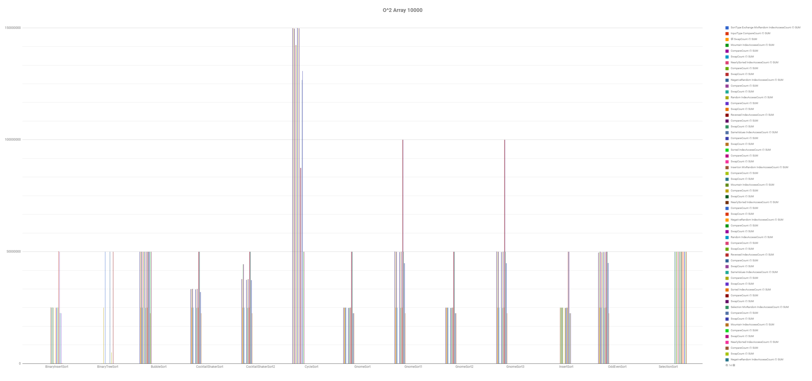

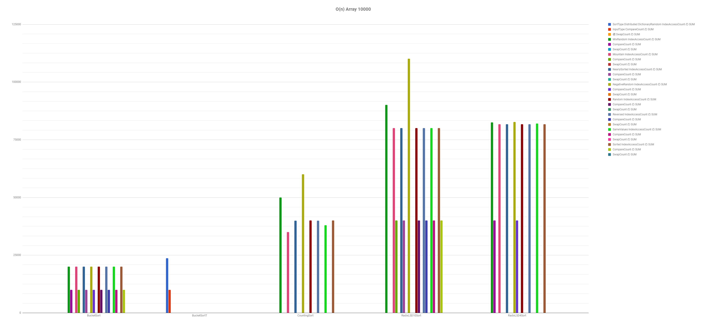

### By SortType

Show Image

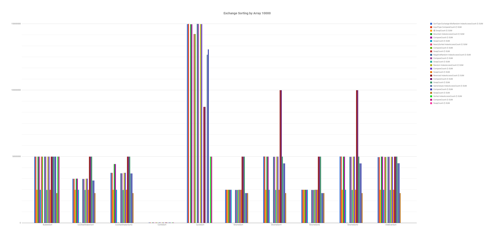
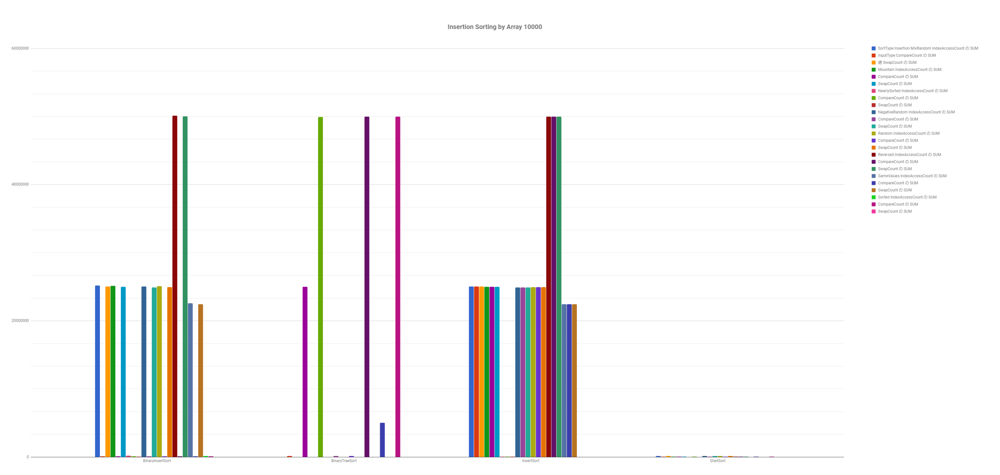
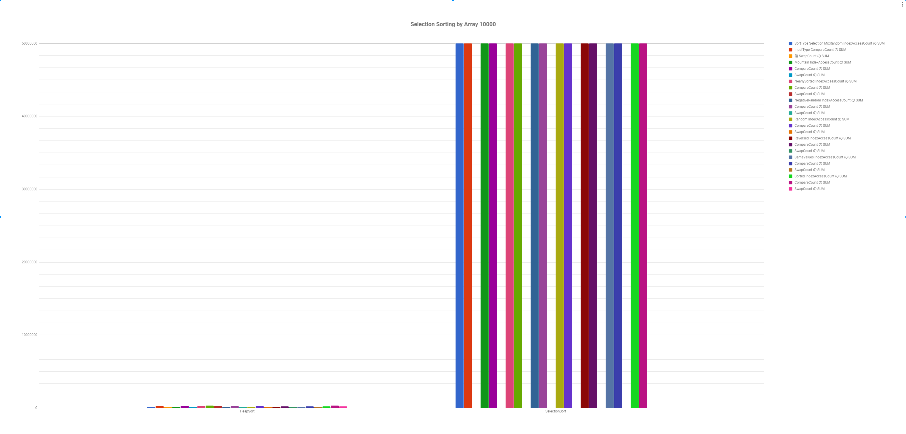

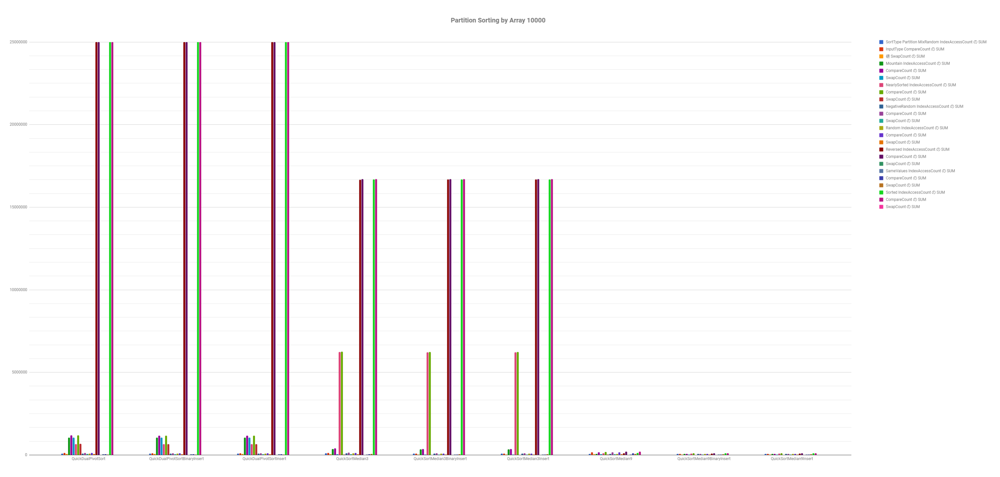
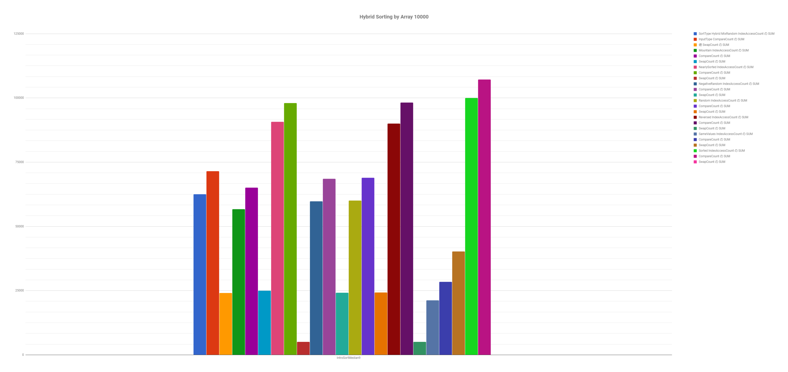
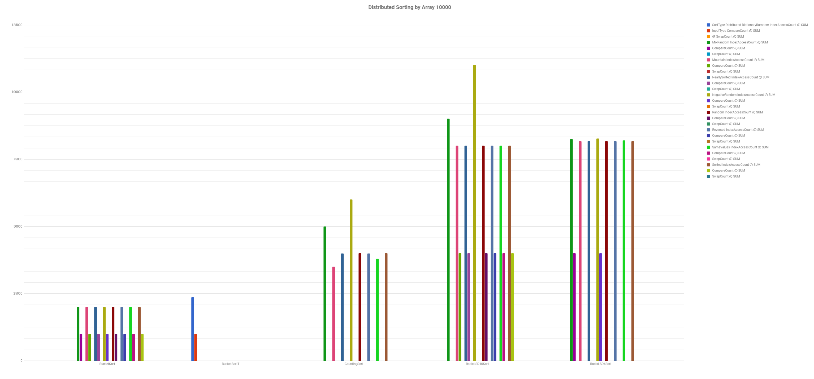

### By InputType

Show Image

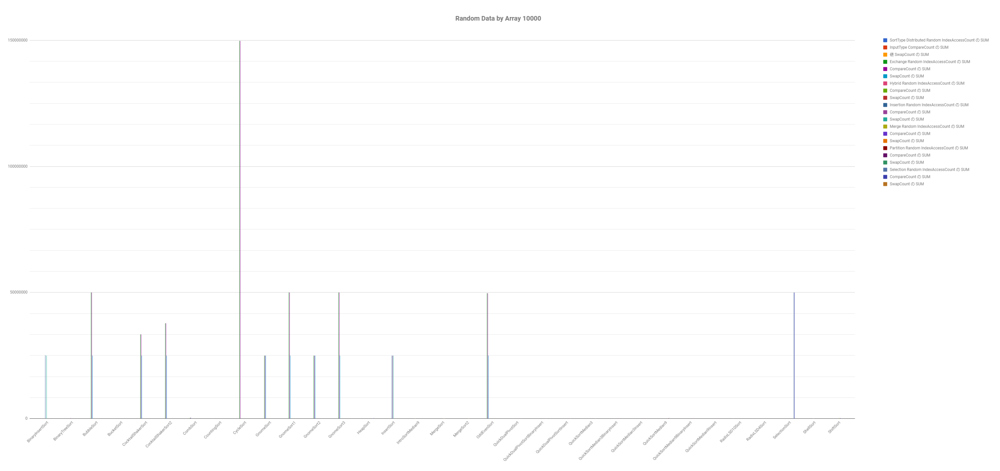
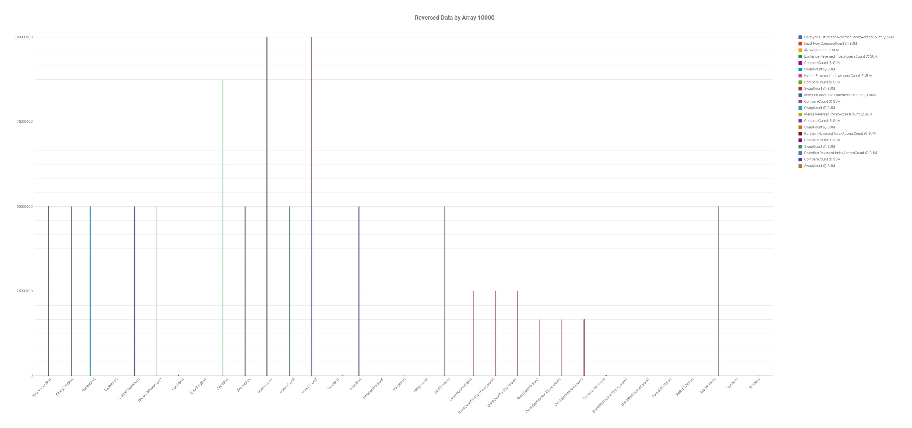
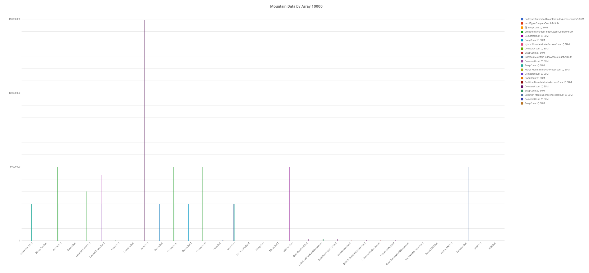
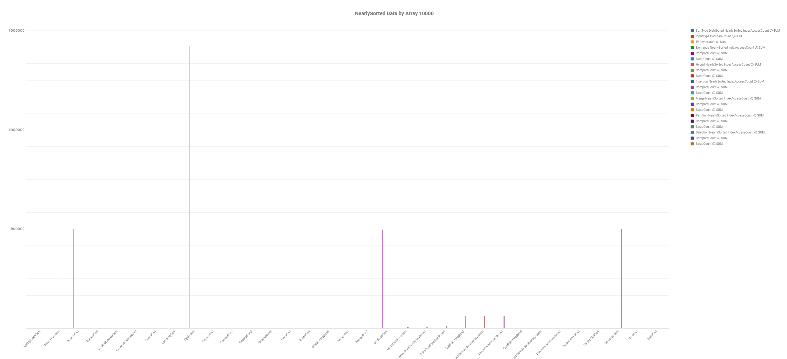

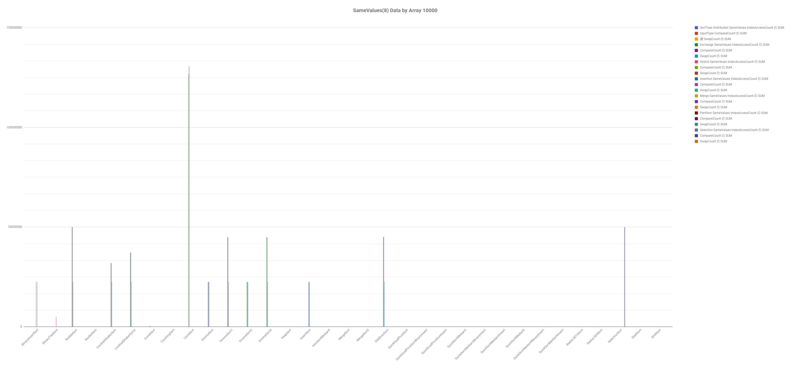

